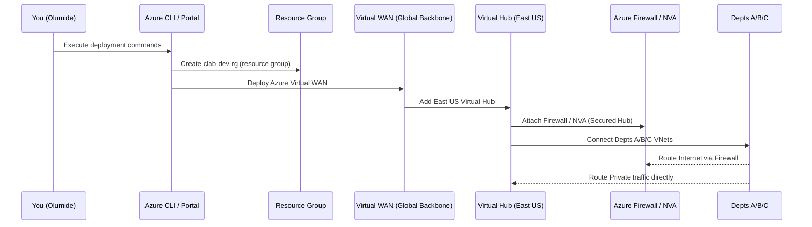

# 🌐 Azure Virtual WAN Architecture — Department-Optimized Course
**Tutor:** ChatGPT × Olumide  
**GitHub Repo:** `olumidetowoju/vwan-dept-architecture-labs`  
**Subscription ID:** 56d9a9d0-65a3-4aea-9957-ff103f641f9c  
**Region:** East US  
**Naming Prefix:** `clab-dev-001`

---

## 🎯 Course Objective
Build one Azure network that serves departments with **different security and performance needs** using **Azure Virtual WAN**.  
You’ll deploy → test → destroy each lab to control costs.  
All content is written in **textbook + hands-on lab style** with **Mermaid diagrams**.

---

## 🗂️ Clickable Syllabus

| Day | Topic | Lab File |
|:---:|:------|:---------|
| 1 | [Foundations & Prereqs](labs/day01-foundations.md) | Environment setup & mental model |
| 2 | [Deploy Virtual WAN & Core Hub](labs/day02-vwan-core-hub.md) | Deploy Virtual WAN, Hub, and Dept VNets |
| 3 | [Secured Virtual Hub (Azure Firewall Manager)](labs/day03-secured-virtual-hub.md) | Deploy Azure Firewall & convert Hub to Secured mode |
| 4 | [Routing Intent & Dept Profiles](labs/day04-routing-intent-dept-profiles.md) | Hub routing intent + per-dept controls |
| 5 | [Branch / Remote Connectivity (S2S + P2S)](labs/day05-branch-remote-connectivity.md) | Extend vWAN with Site-to-Site (VPN Site) and Point-to-Site (P2S) for remote users |
| 6 | [Monitoring & Observability](labs/day06-monitoring-observability.md) | vWAN Insights, Flow Logs & Connection Monitor |
| 7 | Multi-Region DR | *(later)* |
| 8 | NVAs & 3rd-Party Firewalls | *(later)* |
| 9 | Guardrails & Governance | *(later)* |
| 10 | Cost Management & Cleanup | *(later)* |

---

## 🧠 Concept Analogy
Think of Azure Virtual WAN as a network of airports ✈️:

| Concept | Analogy | Purpose |
|----------|----------|---------|
| Virtual WAN | 🌎 Airline Alliance | Global backbone connecting all regional hubs |
| Virtual Hub | 🏢 Regional Airport | Routes and manages local VNets |
| Secured Hub | 🔐 Airport with central security | Adds Azure Firewall / NVA for inspection |
| Routing Intent | 🧭 Airport signs | Directs traffic to security or express lane |

---

## 🏗️ Overall Architecture Preview

---

🧰 Tools & Conventions
Azure CLI + Portal for hands-on steps

nano for editing files

Mermaid diagrams for visual understanding

Bicep templates (in /bicep) for reproducible deploys

Cleanup scripts to control costs

💵 Free-Tier Guideline
Each lab ends with a cleanup block:

bash
Copy code
az group delete -n clab-dev-rg --yes --no-wait
Only keep resources alive while testing.

🚀 Begin the Course
➡ Start with Day 1 – Foundations & Prereqs
