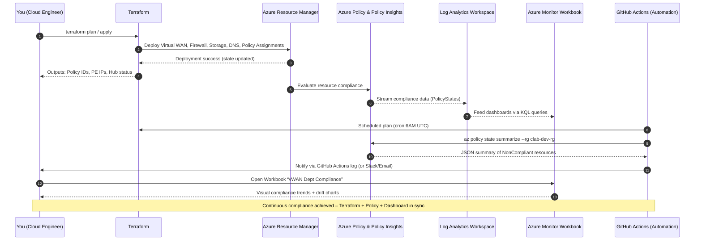

# 🧭 Day 10 – Continuous Compliance & Governance Dashboard

**Quick Links:**  
[▶ 1. Overview](#1-overview) • [▶ 2. Architecture Diagram](#2-architecture-diagram) • [▶ 3. Workbook Setup](#3-workbook-setup) • [▶ 4. Policy Insights Query](#4-policy-insights-query) • [▶ 5. Automation Pipeline](#5-automation-pipeline) • [▶ 6. Dashboard Deployment](#6-dashboard-deployment) • [▶ 7. Validation & Cleanup](#7-validation--cleanup)

---

## 1️ Overview
**Goal:** Operationalize the governance from Day 8 and the IaC from Day 9 into a **self-updating compliance dashboard** that tracks your Virtual WAN departments, Firewall Policies, and Storage Accounts.

**Outcome:**  
A real-time Azure Monitor Workbook (or Power BI connector) that visualizes:
- Policy Compliance by Department (VNet or Resource Group)
- Drifted Resources (Non-Compliant)
- Firewall Threat Intel Mode and Private Link Coverage
- Terraform state health & drift detection

---

## 2️ 🔁 Day 10 – Continuous Compliance Sequence

---

## 3️ Workbook Setup (Azure Portal or CLI)

Option A – From Portal
Go to Azure Monitor → Workbooks → New

Set Title: “vWAN Dept Compliance Dashboard”

Add data source: Azure Policy Insights → PolicyStates (last 1 day)

Add query sections for each resource type (e.g., Storage, vHub, Firewall)

Option B – From CLI
az monitor workbook create \
  --resource-group clab-dev-rg \
  --name "vWAN-Dept-Compliance" \
  --display-name "vWAN Department Compliance Dashboard" \
  --source-id "/subscriptions/<SUB_ID>/resourceGroups/clab-dev-rg" \
  --location eastus \
  --gallery "workbook"

## 4️ Policy Insights Query (Sample KQL)

PolicyResources
| where TimeGenerated > ago(1d)
| where ComplianceState == "NonCompliant"
| summarize NonCompliant = count() by ResourceGroup, PolicyDefinitionName
| sort by NonCompliant desc
Add a second tab for Firewall Policy Mode:

AzureDiagnostics
| where Category == "AzureFirewallPolicyLog"
| summarize Alerts = count() by ThreatIntelMode, ResourceGroup

## 5️ Automation Pipeline (Drift Detection)

Terraform + Azure Policy Check
Create a simple GitHub Action (.github/workflows/compliance.yml):

name: Terraform & Compliance Check

on:
  schedule:
    - cron: '0 6 * * *'  # daily 6 AM UTC
  workflow_dispatch:

jobs:
  check:
    runs-on: ubuntu-latest
    steps:
      - uses: actions/checkout@v4
      - uses: hashicorp/setup-terraform@v3
        with:
          terraform_version: 1.8.0
      - name: Terraform Plan
        run: terraform -plan -detailed-exitcode || true
      - name: Azure Policy Summary
        run: az policy state summarize --resource-group clab-dev-rg -o table

## 6️ Dashboard Deployment (Output Example)

az monitor workbook list -g clab-dev-rg -o table
az monitor workbook show -g clab-dev-rg -n "vWAN-Dept-Compliance" -o jsonc
Export to Power BI (optional):

Portal → Workbook → “Export to Power BI Template”

In Power BI, add Policy Insights connector

## 7️ Validation & Cleanup

az policy state summarize -g clab-dev-rg -o table
az monitor workbook delete -g clab-dev-rg -n "vWAN-Dept-Compliance"
terraform destroy -auto-approve

## ✅ Expected Result

Visual dashboard of compliance per resource group

Automated daily plan + policy summary via GitHub Actions

Zero manual drift checks needed

## 🧭 Navigation

Prev	Next
⬅️ Day 9 – Infrastructure as Code (Terraform Automation)	🏁 End of Course
