# 🧭 Day 8 – Governance & Compliance (Private Link + Policy)

**Quick Links:**  
[▶ 1. List Top Non-Compliant Policies](#1-list-top-noncompliant-policies) •  
[▶ 2. Show Policy Names & Effects](#2-show-policy-names--effects) •  
[▶ 3. Disable Shared Key Access](#3-disable-shared-key-access) •  
[▶ 4. Restrict Network Access (VNet Rules)](#4-restrict-network-access-vnet-rules) •  
[▶ 5. Private Link (PE + DNS)](#5-private-link-pe--dns--one-account-at-a-time) •  
[▶ 6. Firewall Threat Intelligence (Secured vHub)](#6-firewall-threat-intelligence-secured-vhub) •  
[▶ 7. Exemptions for PE VNet](#7-exemptions-for-pe-vnet-optional) •  
[▶ 8. Re-Check Compliance](#8-re-check-compliance) •  
[▶ 9. Troubleshooting](#9-troubleshooting)

---

## 🧩 Governance & Compliance Flow (Sequence Diagram)

```mermaid
sequenceDiagram
    participant User as Engineer (You)
    participant Policy as Azure Policy
    participant Storage as Storage Account
    participant PE as Private Endpoint
    participant DNS as Private DNS Zone
    participant FW as Firewall Policy

    User->>Policy: Query policy state list (NonCompliant)
    Policy->>User: Return IDs + Display Names
    User->>Storage: Disable Shared Key access
    User->>Storage: Restrict network access (Deny / Disable public)
    User->>PE: Create Private Endpoint (Blob)
    PE->>DNS: Register A record (privatelink.blob.core.windows.net)
    DNS->>Storage: Resolve to private IP
    User->>FW: Update ThreatIntelMode = Alert
    FW-->>Policy: Report compliance status
    Policy-->>User: Show “✅ Compliant” summary
```

---

**1️ List Top Non-Compliant Policies**

RG="${RG:-clab-dev-rg}"

az policy state list --resource-group "$RG" \
  --query "[?complianceState=='NonCompliant'].policyDefinitionId" -o tsv \
  | sort | uniq -c | sort -nr | head -8

**2️ Show Policy Names & Effects**

API="2021-06-01"
for ID in $(az policy state list --resource-group "$RG" \
            --query "[?complianceState=='NonCompliant'].policyDefinitionId" -o tsv | sort -u); do
  NAME=$(az rest --method get --url "https://management.azure.com${ID}?api-version=${API}" \
    --query "properties.displayName" -o tsv 2>/dev/null)
  EFFECT=$(az rest --method get --url "https://management.azure.com${ID}?api-version=${API}" \
    --query "properties.policyRule.then.effect" -o tsv 2>/dev/null)
  printf "%-90s  %-8s  %s\n" "$ID" "$EFFECT" "$NAME"
done | sort

**3️ Disable Shared Key Access**

for SA in $(az policy state list --resource-group "$RG" \
  --query "[?contains(resourceType,'Microsoft.Storage/storageAccounts') && complianceState=='NonCompliant'].resourceId" -o tsv | sort -u); do
  SA_NAME=$(basename "$SA")
  SA_RG=$(az storage account show -n "$SA_NAME" --query resourceGroup -o tsv)
  az storage account update -g "$SA_RG" -n "$SA_NAME" --allow-shared-key-access false
done

**4️ Restrict Network Access (VNet Rules)**

for SA in $(az policy state list --resource-group "$RG" \
  --query "[?contains(resourceType,'Microsoft.Storage/storageAccounts') && complianceState=='NonCompliant'].resourceId" -o tsv | sort -u); do
  SA_NAME=$(basename "$SA")
  SA_RG=$(az storage account show -n "$SA_NAME" --query resourceGroup -o tsv)
  az storage account update -g "$SA_RG" -n "$SA_NAME" --public-network-access Disabled
  az storage account update -g "$SA_RG" -n "$SA_NAME" --default-action Deny
done

**5️ Private Link (PE + DNS) – One Account at a Time**

RG_NET="clab-dev-rg"; LOC="eastus"; PE_VNET="clab-pe-vnet"; PE_SUBNET="pe-subnet"
az network vnet create -g "$RG_NET" -n "$PE_VNET" --location "$LOC" \
  --address-prefixes 10.200.0.0/24 --subnet-name "$PE_SUBNET" --subnet-prefix 10.200.0.0/27
az network vnet subnet update -g "$RG_NET" --vnet-name "$PE_VNET" -n "$PE_SUBNET" \
  --private-endpoint-network-policies Disabled

ZRG="$RG_NET"
az network private-dns zone create -g "$ZRG" -n "privatelink.blob.core.windows.net" >/dev/null || true
PE_VNET_ID=$(az network vnet show -g "$RG_NET" -n "$PE_VNET" --query id -o tsv)
az network private-dns link vnet create -g "$ZRG" -z "privatelink.blob.core.windows.net" \
  -n "link-${PE_VNET}-blob" --virtual-network "$PE_VNET_ID" --registration-enabled false >/dev/null || true

SA_NAME="clabdevflow1762127757"
SA_RG=$(az storage account show -n "$SA_NAME" --query resourceGroup -o tsv)
SA_ID="/subscriptions/56d9a9d0-65a3-4aea-9957-ff103f641f9c/resourceGroups/${SA_RG}/providers/Microsoft.Storage/storageAccounts/${SA_NAME}"
PE_SUBNET_ID=$(az network vnet subnet show -g "$RG_NET" --vnet-name "$PE_VNET" -n "$PE_SUBNET" --query id -o tsv)
PE_NAME="${SA_NAME}-pe-blob"

az network private-endpoint create -g "$RG_NET" -n "$PE_NAME" \
  --location "$LOC" --subnet "$PE_SUBNET_ID" \
  --private-connection-resource-id "$SA_ID" --group-ids blob \
  --connection-name "${PE_NAME}-conn"

PE_NIC_ID=$(az network private-endpoint show -g "$RG_NET" -n "$PE_NAME" \
  --query "networkInterfaces[0].id" -o tsv)
PE_IP=$(az network nic show --ids "$PE_NIC_ID" \
  --query "ipConfigurations[0].privateIpAddress" -o tsv)
[ -z "$PE_IP" ] && PE_IP=$(az network private-endpoint show -g "$RG_NET" -n "$PE_NAME" \
  --query "customDnsConfigs[0].ipAddresses[0]" -o tsv)

EXISTING=$(az network private-dns record-set a show -g "$ZRG" -z "privatelink.blob.core.windows.net" \
  -n "$SA_NAME" --query "arecords[].ipv4Address" -o tsv 2>/dev/null)
echo "$EXISTING" | grep -qx "$PE_IP" || az network private-dns record-set a add-record \
  -g "$ZRG" -z "privatelink.blob.core.windows.net" -n "$SA_NAME" -a "$PE_IP"

**6️ Firewall Threat Intelligence (Secured vHub)**

POLICY_ID=$(az network firewall show -g clab-dev-rg -n clab-dev-fw \
  --query "firewallPolicy.id" -o tsv)
az network firewall policy update --ids "$POLICY_ID" --threat-intel-mode Alert

**7️ Exemptions for PE VNet (Optional)**

ASSIGN_ID="/subscriptions/56d9a9d0-65a3-4aea-9957-ff103f641f9c/providers/Microsoft.Authorization/policyAssignments/securitycenterbuiltin"
SCOPE="/subscriptions/56d9a9d0-65a3-4aea-9957-ff103f641f9c/resourceGroups/clab-dev-rg/providers/Microsoft.Network/virtualNetworks/clab-pe-vnet"

az policy exemption create --name "exempt-pevnet-route-via-afw" \
  --scope "$SCOPE" --policy-assignment "$ASSIGN_ID" \
  --exemption-category Waiver \
  --display-name "PE VNet hosts only Private Endpoints; no Internet egress"

az policy exemption create --name "exempt-pevnet-ddos" \
  --scope "$SCOPE" --policy-assignment "$ASSIGN_ID" \
  --exemption-category Waiver \
  --display-name "PE VNet is not Internet-facing; DDoS Standard not applicable"

**8️ Re-Check Compliance**

az policy state summarize --resource-group "$RG" \
  --query "{nonCompliant:summaryResults[0].nonCompliantResources, compliant:summaryResults[0].compliantResources}" -o table

az policy state list --resource-group "$RG" \
  --query "[?complianceState=='NonCompliant'].[policyDefinitionId,resourceId,complianceReasonCode]" -o table

**9️ Troubleshooting**

ResourceGroupNotFound → Verify RG with az group list -o table

Duplicate A-record IP → Already exists; remove or skip

az network private-dns record-set a show -g "$ZRG" -z "privatelink.blob.core.windows.net" -n "$SA_NAME" \
  --query "arecords[].ipv4Address" -o tsv
AZFW_Hub TI mode → Set on Firewall Policy, not azureFirewalls

## ✅ Result:

All storage accounts use Private Link, network access is restricted, and Secured vHub Firewall Policy is compliant with Azure Policy.

Proceed to ➡ Day 9 – Terraform Automation when ready.

