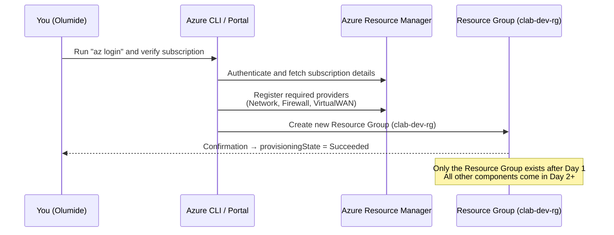
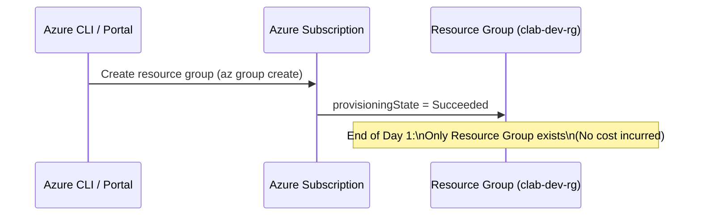

# 🧱 Day 1 – Foundations & Prerequisites

## 🎯 Objectives
1. Understand Virtual WAN concepts and analogy.  
2. Prepare your Azure subscription and providers.  
3. Create naming variables for reusability.  
4. Verify permissions and no costs yet.

---

## 🧠 Virtual WAN in Simple Terms
Azure Virtual WAN is a **global network service** that lets you connect VNets, branches, and remote users to Microsoft’s backbone with central management.

Imagine it as a **world of airports** where:
- The **WAN** is the airline alliance.  
- Each **Hub** is a regional airport.  
- **Firewalls / NVAs** are security checkpoints.  
- **Routing Intent** are signboards that decide which travelers go through security.

---

## 🏗️ High-Level Diagram

---

## ⚙️ Setup Environment

1️⃣ Confirm Subscription
az account show -o table
✅ Ensure subscription ID = 56d9a9d0-65a3-4aea-9957-ff103f641f9c.

2️⃣ Register Required Providers
az provider register --namespace Microsoft.Network
az provider register --namespace Microsoft.Firewall
az provider register --namespace Microsoft.VirtualWAN

3️⃣ Define Naming Variables
LOCATION=eastus
PREFIX=clab
ENV=dev
SUFFIX=001
RG=${PREFIX}-${ENV}-rg
VWAN=${PREFIX}-${ENV}-vwan
VHUB=${PREFIX}-${ENV}-hub-${LOCATION}

4️⃣ Create Resource Group
az group create -n $RG -l $LOCATION
✅ Output should show provisioningState = Succeeded.

## 🧩 Department Profiles
Department	Focus	Internet Traffic	Private Traffic
Dept A – Strict	Maximum Security	via Firewall	via Firewall
Dept B – Balanced	Mix of Speed & Safety	via Firewall	Direct
Dept C – Performance	Low Latency	via Firewall	Direct

## 🧭 Diagram – Current State

---

## ✅ Verify

az group list -o table
``>
You should see `clab-dev-rg`.

---

## 💰 Cost Check
All operations today are **Free**. No compute or network billing.

---

## 🧹 Cleanup (Optional)

az group delete -n $RG --yes --no-wait

## 🧭 Next Preview

Tomorrow (Day 2) you’ll:

Create the Virtual WAN (“airline alliance”)

Add a Virtual Hub (“regional airport”)

Connect Dept A/B/C VNets

yaml
Copy code
