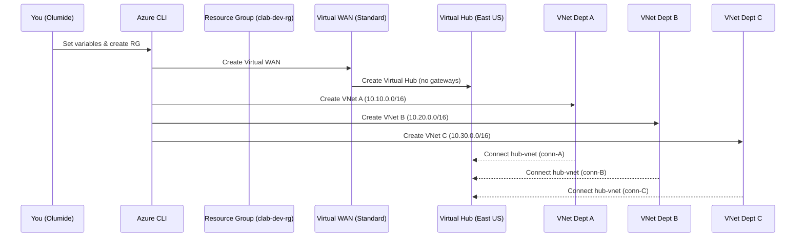

# 🏗️ Day 2 — Deploy Azure Virtual WAN & Core Hub

## 🎯 Objectives
- Create a **Virtual WAN (Standard)**.
- Create a **Virtual Hub** (no gateways yet).
- Create three **Dept VNets** and connect them to the hub.

---

🧭 Sequence (What happened today)


---

## ⚙️ Variables
```bash
LOCATION=eastus
PREFIX=clab; ENV=dev; SUFFIX=001
RG=${PREFIX}-${ENV}-rg
VWAN=${PREFIX}-${ENV}-vwan
VHUB=${PREFIX}-${ENV}-hub-${LOCATION}

VNETA=${PREFIX}-${ENV}-vnet-deptA
VNETB=${PREFIX}-${ENV}-vnet-deptB
VNETC=${PREFIX}-${ENV}-vnet-deptC
ADDR_VNETA=10.10.0.0/16
ADDR_VNETB=10.20.0.0/16
ADDR_VNETC=10.30.0.0/16
🪣 Create Resource Group (if needed)
bash
Copy code
az group create -n $RG -l $LOCATION
🌐 Create Virtual WAN
bash
Copy code
az network vwan create -g $RG -n $VWAN --type Standard
🛞 Create Virtual Hub (no gateways — quick)
bash
Copy code
az network vhub create \
  -g $RG -n $VHUB \
  --vwan $VWAN \
  --address-prefix 10.0.0.0/23 \
  --location $LOCATION
🧩 Create Dept VNets
bash
Copy code
az network vnet create -g $RG -n $VNETA -l $LOCATION --address-prefixes $ADDR_VNETA
az network vnet create -g $RG -n $VNETB -l $LOCATION --address-prefixes $ADDR_VNETB
az network vnet create -g $RG -n $VNETC -l $LOCATION --address-prefixes $ADDR_VNETC
🔗 Connect VNets to the Hub
bash
Copy code
VNETA_ID=$(az network vnet show -g $RG -n $VNETA --query id -o tsv)
VNETB_ID=$(az network vnet show -g $RG -n $VNETB --query id -o tsv)
VNETC_ID=$(az network vnet show -g $RG -n $VNETC --query id -o tsv)

az network vhub connection create -g $RG --vhub-name $VHUB -n conn-${VNETA} --remote-vnet $VNETA_ID
az network vhub connection create -g $RG --vhub-name $VHUB -n conn-${VNETB} --remote-vnet $VNETB_ID
az network vhub connection create -g $RG --vhub-name $VHUB -n conn-${VNETC} --remote-vnet $VNETC_ID
✅ Validate
bash
Copy code
az network vhub show -g $RG -n $VHUB -o table
az network vhub connection list -g $RG --vhub-name $VHUB -o table
az network vnet list -g $RG -o table

🧹 Cleanup (optional)
az group delete -n $RG --yes --no-wait
