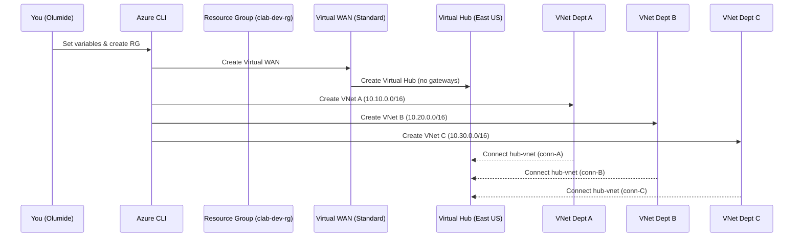

# 🏗️ Day 2 – Deploy Azure Virtual WAN & Core Hub

## 🎯 Objectives
Today you will:
1. Deploy the **Azure Virtual WAN** (Standard type) — the global “airline alliance.”
2. Create a **Virtual Hub** — your first regional “airport terminal.”
3. Build three departmental VNets (A, B, C) to represent your departments.
4. Connect those VNets to the Hub to form the first functional network fabric.
5. Validate connectivity and prepare for Day 3’s security expansion.

---

## 🧠 Concept Snapshot
Think of Azure Virtual WAN as a **global highway system** and the Virtual Hub as the **interchange** where all local routes (VNets) meet.

| Concept | Analogy | Description |
|----------|----------|-------------|
| **Virtual WAN** | 🌎 Airline Alliance / Global Highway | Provides the global backbone that interconnects all hubs. |
| **Virtual Hub** | 🏢 Regional Airport / Interchange | A managed routing point inside the Virtual WAN. |
| **VNet** | 🏘 Department Campus | Each department’s isolated local network. |
| **VHub Connection** | ✈️ Flight Route / On-Ramp | Connects a VNet into the hub’s routing plane. |

---

🧭 Sequence (What happened today)

---

🧱 Step 1 – Create Resource Group
bash
Copy code
az group create -n $RG -l $LOCATION
✅ Expected: "provisioningState": "Succeeded"

🌐 Step 2 – Create Virtual WAN
bash
Copy code
az network vwan create -g $RG -n $VWAN --type Standard
This initializes the global “airline alliance.”
Standard type enables inter-region connectivity and security options used later.

🛞 Step 3 – Create Virtual Hub
bash
Copy code
az network vhub create \
  -g $RG -n $VHUB \
  --vwan $VWAN \
  --address-prefix 10.0.0.0/23 \
  --location $LOCATION
Hubs without gateways deploy in about 5–7 min.

🧩 Step 4 – Create Dept VNets
bash
Copy code
az network vnet create -g $RG -n $VNETA -l $LOCATION --address-prefixes $ADDR_VNETA
az network vnet create -g $RG -n $VNETB -l $LOCATION --address-prefixes $ADDR_VNETB
az network vnet create -g $RG -n $VNETC -l $LOCATION --address-prefixes $ADDR_VNETC
VNet	Address Space	Purpose
Dept A	10.10.0.0/16	Strict Security (will route all via FW)
Dept B	10.20.0.0/16	Balanced Dept
Dept C	10.30.0.0/16	High-Performance Dept

🔗 Step 5 – Connect VNets to Hub
Grab each VNet’s resource ID and connect:

bash
Copy code
VNETA_ID=$(az network vnet show -g $RG -n $VNETA --query id -o tsv)
VNETB_ID=$(az network vnet show -g $RG -n $VNETB --query id -o tsv)
VNETC_ID=$(az network vnet show -g $RG -n $VNETC --query id -o tsv)

az network vhub connection create -g $RG --vhub-name $VHUB -n conn-${VNETA} --remote-vnet $VNETA_ID
az network vhub connection create -g $RG --vhub-name $VHUB -n conn-${VNETB} --remote-vnet $VNETB_ID
az network vhub connection create -g $RG --vhub-name $VHUB -n conn-${VNETC} --remote-vnet $VNETC_ID
🕐 If the hub isn’t ready yet, rerun after 2–3 minutes.

🧭 Step 6 – Validate Deployment
bash
Copy code
az network vhub show -g $RG -n $VHUB -o table
az network vhub connection list -g $RG --vhub-name $VHUB -o table
az network vnet list -g $RG -o table
Expected findings:

1 Virtual Hub in Succeeded state

3 Hub connections (conn-clab-dev-vnet-deptA/B/C)

3 VNets listed

🧠 Troubleshooting Tips
Symptom	Cause	Fix
“Hub not found”	Hub still provisioning	Wait 2–3 min then re-run connection command
“Address prefix conflict”	Overlapping CIDRs	Adjust each Dept VNet prefix to unique ranges
“Insufficient permissions”	Not logged in or wrong subscription	Run az login and az account set --subscription …

🧩 Conceptual Recap

You’ve created your central transit hub.

Each department now has a VNet “campus” connected through the hub.

No security enforcement yet — all traffic is open, just routed.

In Day 3, we’ll secure the hub with Azure Firewall Manager to control ingress / egress.

🧹 Cleanup (Optional)

To save credits:

az group delete -n $RG --yes --no-wait

✅ End-of-Day 2 Checklist
Step	Description	Status
Virtual WAN Created	Global backbone in place	✅
Virtual Hub Created	Regional router live	✅
Dept VNets Created	A/B/C deployed	✅
Connections Complete	3 VHub connections	✅
Validated	Hub + VNets visible in list	✅
Cleaned Up	Resources removed after test	✅
🚀 Next Up — Day 3 Secured Virtual Hub

Tomorrow we’ll:

Add Azure Firewall inside the hub.

Associate a Firewall Policy.

Convert the Hub to a Secured Hub (traffic inspection enabled).
