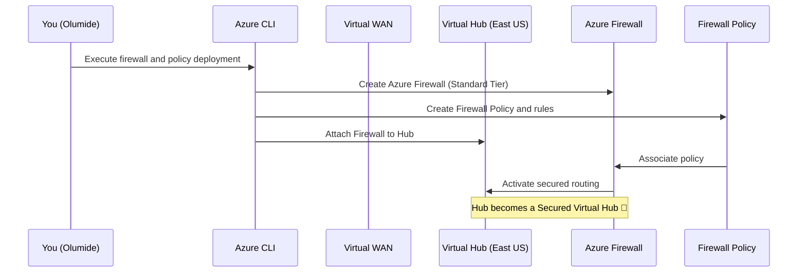

# 🔐 Day 3 – Secured Virtual Hub (Azure Firewall Manager)

## 🎯 Objectives
Today you will:
1. Deploy **Azure Firewall** inside the existing Virtual Hub.  
2. Create a **Firewall Policy** and associate it.  
3. Understand what makes a hub “secured.”  
4. Validate the security posture and clean up.

---

## 🧠 Concept Snapshot

| Concept | Analogy | Description |
|----------|----------|-------------|
| **Azure Firewall** | 🚓 Airport security checkpoint | Filters and inspects traffic between departments and the Internet. |
| **Firewall Policy** | 📜 Rulebook | Defines what’s allowed or denied. |
| **Firewall Manager** | 🕵️ Security Director | Centralizes policies for all secured hubs. |
| **Secured Hub** | 🏰 Fortified Terminal | A hub with an attached Azure Firewall and routing intent configured. |

---

🧭 Sequence Diagram – Secured Hub Activation

---

🧱 Step 1 – Create or Confirm Resource Group

If you cleaned up after Day 2, recreate the base group:

az group create -n $RG -l $LOCATION

🌐 Step 2 – Recreate or Confirm Virtual WAN + Hub

(If still exists, skip these; otherwise, rebuild)

az network vwan create -g $RG -n $VWAN --type Standard
az network vhub create -g $RG -n $VHUB --vwan $VWAN --address-prefix 10.0.0.0/23 -l $LOCATION

🧩 Step 3 – Create the Firewall Policy
az network firewall policy create -g $RG -n $POLICY -l $LOCATION

Optional – add a baseline rule collection to allow HTTPS out:

az network firewall policy rule-collection-group create \
  -g $RG -p $POLICY -n allow-web \
  --priority 1000 \
  --rule-collection-groups '[
    {
      "name": "AllowWeb",
      "priority": 100,
      "ruleCollections": [
        {
          "ruleCollectionType": "FirewallPolicyFilterRuleCollection",
          "name": "allowHTTPS",
          "priority": 100,
          "action": {"type": "Allow"},
          "rules": [
            {
              "ruleType": "NetworkRule",
              "name": "AllowHTTPSRule",
              "ipProtocols": ["TCP"],
              "destinationPorts": ["443"],
              "sourceAddresses": ["*"],
              "destinationAddresses": ["*"]
            }
          ]
        }
      ]
    }
  ]'

🔥 Step 4 – Deploy Azure Firewall (Secured Hub Mode)
az network firewall create -g $RG -n $FW -l $LOCATION --tier Standard

💡 This takes 10–15 minutes — Azure provisions the backend and associates with VWAN resources.

After the Firewall finishes provisioning, attach it to your Hub:

az network vhub update -g $RG -n $VHUB --firewall $FW

Then link your policy to the firewall:

az network firewall policy association create -g $RG -f $FW --policy $POLICY

🛡 Step 5 – Validate Secured Hub Status

Run:

az network vhub show -g $RG -n $VHUB --query "properties.securityProviderName" -o tsv

✅ Expected output:

AzureFirewall

Also verify:

az network firewall show -g $RG -n $FW -o table
az network firewall policy show -g $RG -n $POLICY -o table

🧠 What Just Happened?

The Virtual Hub is now a secured hub, meaning:

Internet-bound traffic can be forced through the Azure Firewall.

Firewall Manager centrally manages policies and rules.

All VNets attached to this Hub gain secure egress by default.

Think of this as installing airport security at your main terminal.

🧪 Optional Verification (Portal)

In the Azure Portal:

Go to Virtual WAN → Virtual Hub → Security.

You’ll see “Secured Virtual Hub” enabled with Azure Firewall as the provider.

The “Routing Intent” option becomes available — we’ll configure that in Day 4.

💰 Cost Awareness

Azure Firewall incurs hourly cost even when idle.
Always delete the RG when done to avoid charges.

🧹 Cleanup (Recommended)
az group delete -n $RG --yes --no-wait

✅ End-of-Day 3 Checklist
Step	Description	Status
Firewall Policy Created	Rule framework exists	✅
Azure Firewall Deployed	In Secured Hub	✅
Policy Associated	Connected successfully	✅
Hub Secured	Verified AzureFirewall	✅
Cleanup Completed	Avoided extra cost	✅
📘 Next – Day 4: Routing Intent & Department Profiles

In the next lab you will:

Define Routing Intent for Internet and Private traffic.

Assign Department profiles (A = Strict, B = Balanced, C = High Performance).

Use routing tables to simulate department-specific security and performance paths.
