# 🧭 Day 4 – Routing Intent & Department Profiles

## 🎯 Objectives
1. Configure **Routing Intent** on the Virtual Hub to steer Internet and Private traffic.
2. Apply department-specific behavior:
   - **Dept A (Strict):** Internet **via Firewall**, Private **via Firewall**.
   - **Dept B (Balanced):** Internet **via Firewall**, Private **direct**.
   - **Dept C (Performance):** Internet **direct**, Private **direct**.
3. Validate that hub policies and connection flags behave as intended.

---

## 🧠 Concepts in 60 seconds

| Feature | What it does | Notes |
|---|---|---|
| **Routing Intent** | Declarative hub policy that sends **Internet** and/or **Private traffic** to a next-hop (Azure Firewall/NVA) | Hub-level policy. Two policy types: **InternetTraffic** and **PrivateTraffic**. |
| **Internet security (per connection)** | Toggle on a **vHub VNet connection** to force **Internet egress via the hub’s firewall** | Lets you treat A/B/C differently for Internet egress. |
| **vHub route tables (Route Table v3)** | Additional control for **private (east-west)** paths per connection | Use custom route tables and associate them to chosen connections. |

**Docs:** Azure CLI `az network vhub routing-intent` (create/list/show/update) and example for creating two policies (Internet + Private) :contentReference[oaicite:0]{index=0}.  
vHub connection flags include `--internet-security` for per-connection control :contentReference[oaicite:1]{index=1}.  
Route Table v3 supports adding routes with **Firewall** as next hop (ResourceId) :contentReference[oaicite:2]{index=2}.  
Background on routing intent & policies in Virtual WAN: overview/how-to articles :contentReference[oaicite:3]{index=3}.

---

🧭 Sequence – Department Behaviors

```mermaid
sequenceDiagram
    participant A as Dept A (Strict)
    participant B as Dept B (Balanced)
    participant C as Dept C (Performance)
    participant HUB as vHub
    participant RTa as rt-deptA
    participant RTb as rt-deptB (empty)
    participant RTc as rt-deptC (empty)
    participant FW as Azure Firewall

    A->>HUB: Internet egress
    HUB->>FW: enableInternetSecurity = true
    A->>HUB: Private to B/C
    HUB->>RTa: associated_route_table = rt-deptA
    RTa->>FW: 10.20/16, 10.30/16 → nextHop=Firewall

    B->>HUB: Internet egress
    HUB->>FW: enableInternetSecurity = true
    B->>HUB: Private to A/C
    HUB-->>RTb: associated_route_table = rt-deptB (empty → direct)
    RTb-->>B: Direct

    C->>HUB: Internet egress
    HUB-->>C: enableInternetSecurity = false (direct)
    C->>HUB: Private to A/B
    HUB-->>RTc: associated_route_table = rt-deptC (empty → direct)
    RTc-->>C: Direct
```


---

🛠️ Step 1 — Create Routing Intent (Hub-level)

One intent with two routing policies pointing to the hub firewall.

az network vhub routing-intent create \
  -g $RG \
  --vhub $VHUB \
  -n ${PREFIX}-${ENV}-ri \
  --routing-policies "[{name:InternetTraffic,destinations:[Internet],nextHop:$FW_ID},{name:PrivateTraffic,destinations:[PrivateTraffic],nextHop:$FW_ID}]"


What this does:

Internet traffic path = 🔜 Firewall

Private traffic (VNet-to-VNet, S2S, P2S, ER) = 🔜 Firewall
(We’ll relax this per department in Step 2/3.)

Check:

az network vhub routing-intent show -g $RG --vhub $VHUB -n ${PREFIX}-${ENV}-ri -o jsonc

🧩 Step 2 — Internet behavior per department (connection-level)

Dept A – Strict (Internet via Firewall): (default is enabled but we enforce for clarity)

az network vhub connection update -g $RG --vhub-name $VHUB -n $CONNA --internet-security true


Dept B – Balanced (Internet via Firewall):

az network vhub connection update -g $RG --vhub-name $VHUB -n $CONNB --internet-security true


Dept C – Performance (Internet direct):

az network vhub connection update -g $RG --vhub-name $VHUB -n $CONNC --internet-security false


--internet-security is the per-connection switch for secured Internet egress. 
Microsoft Learn

🧭 Step 3 — Private traffic behavior per department

Because our routing intent currently sends PrivateTraffic to the firewall for all connections, we’ll override this for departments that should remain direct using a custom vHub route table and associating it only where needed.

3A) Dept A (Strict): keep Private via Firewall (no change)

Nothing extra needed — Routing Intent already steers Private via FW.

3B) Dept B (Balanced): make Private direct

Create a custom route table with no “to FW” overrides and associate it to Dept B’s connection.

(Route Table v3 without extra routes simply uses the hub’s default/private propagation → direct paths.)

# Create an empty custom route table (no routes added)
az network vhub route-table create \
  -g $RG \
  --vhub-name $VHUB \
  -n rt-deptB

# Grab its id
RTB_ID=$(az network vhub route-table show -g $RG --vhub-name $VHUB -n rt-deptB --query id -o tsv)

# Associate it to Dept B connection
az network vhub connection update \
  -g $RG --vhub-name $VHUB -n $CONNB \
  --associated-route-table $RTB_ID

3C) Dept C (Performance): Private direct (and Internet direct from Step 2)

Same association pattern as B:

az network vhub route-table create \
  -g $RG --vhub-name $VHUB -n rt-deptC

RTC_ID=$(az network vhub route-table show -g $RG --vhub-name $VHUB -n rt-deptC --query id -o tsv)

az network vhub connection update \
  -g $RG --vhub-name $VHUB -n $CONNC \
  --associated-route-table $RTC_ID


If you later want Dept A private to FW in an explicit way, you can create a route table that adds routes with Firewall as next hop (ResourceId) for the other departments’ address spaces and associate that table to Dept A. Example route add shown in Step 4. 
Microsoft Learn

➕ Step 4 — (Optional) Explicit “Private via Firewall” table for Dept A

If you want to enforce that Dept A reaches B/C only through the FW (instead of relying solely on Routing Intent), add explicit routes:

# Create route table for Dept A
az network vhub route-table create \
  -g $RG --vhub-name $VHUB -n rt-deptA

# Add routes to B and C via Firewall as next hop
az network vhub route-table route add \
  -g $RG --vhub-name $VHUB -n rt-deptA \
  --destination-type CIDR \
  --destinations 10.20.0.0/16 10.30.0.0/16 \
  --next-hop-type ResourceId \
  --next-hop $FW_ID

# Associate it to Dept A
RTA_ID=$(az network vhub route-table show -g $RG --vhub-name $VHUB -n rt-deptA --query id -o tsv)

az network vhub connection update \
  -g $RG --vhub-name $VHUB -n $CONNA \
  --associated-route-table $RTA_ID


Route Table v3 next hop to firewall example in docs: vhub route-table route add with --next-hop-type ResourceId pointing at the Azure Firewall resourceId. 
Microsoft Learn

✅ Validation
# 1) Show routing intent
az network vhub routing-intent show -g $RG --vhub $VHUB -n ${PREFIX}-${ENV}-ri -o jsonc

# 2) Check each connection for internet-security and associated route-table
az network vhub connection show -g $RG --vhub-name $VHUB -n $CONNA -o jsonc | jq '.routingConfiguration.internetSecurity, .routingConfiguration.associatedRouteTable.id'
az network vhub connection show -g $RG --vhub-name $VHUB -n $CONNB -o jsonc | jq '.routingConfiguration.internetSecurity, .routingConfiguration.associatedRouteTable.id'
az network vhub connection show -g $RG --vhub-name $VHUB -n $CONNC -o jsonc | jq '.routingConfiguration.internetSecurity, .routingConfiguration.associatedRouteTable.id'

# 3) List route tables for the hub
az network vhub route-table list -g $RG --vhub-name $VHUB -o table


Expected:

Routing intent lists two policies (Internet + Private) with nextHop = your Firewall ID. 
Microsoft Learn

Dept A: internetSecurity = true, associated route table = rt-deptA (if you did Step 4)

Dept B: internetSecurity = true, associated route table = rt-deptB

Dept C: internetSecurity = false, associated route table = rt-deptC

🧹 Cleanup (optional)
az group delete -n $RG --yes --no-wait

✅ End-of-Day 4 Checklist
Item	Result
Routing Intent with Internet+Private → Firewall	✅
Dept A (Strict): Internet via FW, Private via FW	✅
Dept B (Balanced): Internet via FW, Private direct	✅
Dept C (Performance): Internet direct, Private direct	✅
Validation outputs as expected	✅

## ✅ Day 4 – Final Validation Snapshot

```bash
# Internet flags + associated tables (expect A→rt-deptA, B→rt-deptB, C→rt-deptC)
az network vhub connection list -g $RG --vhub-name $VHUB \
  --query "[].{name:name, internet:enableInternetSecurity, assocRT:routingConfiguration.associated_route_table.id}" -o table

# Route tables in hub
az network vhub route-table list -g $RG --vhub-name $VHUB -o table

# Dept A table contents (expect exactly two CIDRs)
az network vhub route-table show -g $RG --vhub-name $VHUB -n rt-deptA \
  --query "routes[].{name:name,dests:destinations}" -o table

🧰 Gotchas & Fixes (vHub Route Table v3)

Remove routes by index (not by name):
az network vhub route-table route remove ... --index <n>

If you get DuplicateDestinations or AnotherOperationInProgress, list routes, remove highest index first, or recreate the table and re-associate.

New schema: Internet flag is enableInternetSecurity (top-level), and route-table paths are snake_case (e.g., routingConfiguration.associated_route_table.id).
