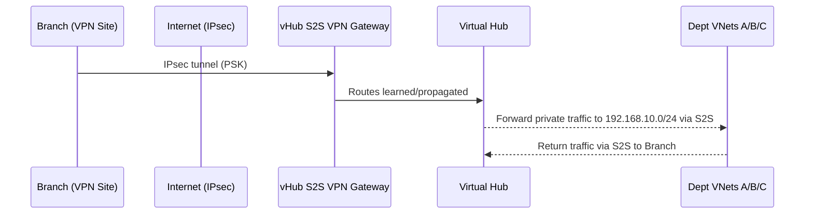
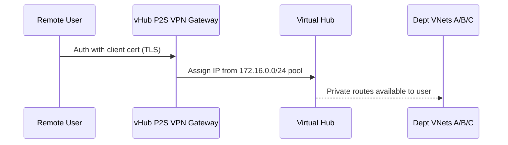

# 🌐 Day 5 – Branch / Remote Connectivity (S2S + P2S)

> Goal: Extend your Virtual WAN hub to *branches* (Site-to-Site/IPsec) and *remote users* (Point-to-Site).  
> We’ll do this **safely** with a **Cost-Safe Track** (no gateways billed) and a **Full Hands-On Track** (real gateways, real tunnels).

---

## 🎯 Objectives

1. Understand how **branches (S2S)** and **remote users (P2S)** attach to a **Virtual WAN hub**.  
2. Deploy **S2S** objects (VPN Site, vWAN S2S VPN Gateway, connection) – or simulate with IaC **what-if** (cost-safe).  
3. Deploy **P2S** objects (VPN Server Configuration, P2S Gateway, client profile) – or simulate with **what-if**.  
4. Validate routes and **tear down** to avoid costs.

---

## 🧠 Concepts in 60 Seconds

| Concept | Analogy | Why it matters |
|---|---|---|
| **VPN Site** | “Business card” of a branch: its public IP and LAN prefixes | The hub needs to know where to send encrypted traffic |
| **vWAN S2S VPN Gateway** | “Hub’s dial-up modem bank” | Terminates IPsec tunnels from many branches at scale |
| **S2S Connection** | “Handshake” between hub and a specific branch | Applies pre-shared key (PSK) and options for that site |
| **VPN Server Config** (P2S) | “Identity bouncer” at the door | Controls how users authenticate (cert/AAD/RADIUS) |
| **P2S Gateway** | “Remote access server” | Assigns a client pool and terminates users’ tunnels |

---

## ✅ Prerequisites (from Days 1–4)

- Resource Group, vWAN, **vHub** in **East US** exist.
- Dept VNets A/B/C are connected and Day-4 policies are in place.
- You’re using the same naming convention.

🧩 Diagrams
S2S – High-Level Flow

---

P2S – High-Level Flow

---

💸 Cost Notes (Read This)

Gateways incur cost while running. If you’re just learning, use Track A (Cost-Safe) first.

When you do Track B (Full), run the Cleanup at the end of the day.

🛣️ Track A – Cost-Safe (No Gateways, No Billing)

Idea: Create all the metadata (parameters, templates) and run what-if to validate without deploying gateways.

A1) S2S “Plan Only” (what-if)
# Parameters for a hypothetical branch
SITE1_NAME=${PREFIX}-${ENV}-site-branch1
SITE1_PUBLIC_IP=203.0.113.10         # <-- placeholder (RFC5737). Replace with real on-prem public IP if you deploy for real.
SITE1_CIDR=192.168.10.0/24

# (No resources created here) – show your intended state in the hub:
cat > /tmp/day5-s2s-plan.json <<'JSON'
{
  "siteName": "${SITE1_NAME}",
  "sitePublicIp": "${SITE1_PUBLIC_IP}",
  "siteAddressSpace": "${SITE1_CIDR}",
  "vhubName": "${VHUB}",
  "resourceGroup": "${RG}"
}
JSON
cat /tmp/day5-s2s-plan.json

Use this “plan” to discuss topology without creating anything.

A2) P2S “Plan Only” (what-if)
P2S_POOL=172.16.0.0/24
cat > /tmp/day5-p2s-plan.json <<'JSON'
{
  "vpnServerAuth": "Certificate",
  "clientPool": "${P2S_POOL}",
  "vhubName": "${VHUB}",
  "resourceGroup": "${RG}"
}
JSON
cat /tmp/day5-p2s-plan.json

If you want to simulate a real deployment plan, you can prep a small Bicep/ARM and run:

az deployment group what-if -g $RG -f ./bicep/day5_s2s_p2s_sample.bicep

(We’ll add a real Bicep example later in the repo.)

🚀 Track B – Full Hands-On (Creates Gateways)

WARNING: This will create billable gateways. Keep scale-unit = 1 and delete them in Cleanup.

B1) Site-to-Site (S2S) – VPN Site → vHub S2S Gateway → Connection
1) Create the VPN Site (branch identity)
SITE1_NAME=${PREFIX}-${ENV}-site-branch1
SITE1_PUBLIC_IP=203.0.113.10     # replace with YOUR real on-prem public IP if available
SITE1_CIDR=192.168.10.0/24

az network vpn-site create \
  -g $RG -n $SITE1_NAME -l $LOCATION \
  --ip-address $SITE1_PUBLIC_IP \
  --address-space $SITE1_CIDR

2) Create the vWAN S2S VPN Gateway in your vHub
S2S_GW=${PREFIX}-${ENV}-s2s-gw

az network vpn-gateway create \
  -g $RG -n $S2S_GW \
  --location $LOCATION \
  --vhub $VHUB \
  --scale-unit 1

⏳ This is long-running. You can check:

az network vpn-gateway show -g $RG -n $S2S_GW --query provisioningState -o tsv

3) Create the S2S connection (PSK)
S2S_CONN=${PREFIX}-${ENV}-s2s-conn-${SITE1_NAME}
S2S_PSK="P@ssw0rd-ChangeMe!"   # replace for production

az network vpn-gateway connection create \
  -g $RG -n $S2S_CONN \
  --gateway-name $S2S_GW \
  --remote-vpn-site $SITE1_NAME \
  --shared-key "$S2S_PSK"

(Optional) Basic health view
az network vpn-gateway connection show -g $RG -n $S2S_CONN -o jsonc
az network vpn-gateway show -g $RG -n $S2S_GW --query "{state:provisioningState,gwId:id}" -o jsonc

B2) Point-to-Site (P2S) – VPN Server Config → P2S Gateway → Client Profile

We’ll use certificate auth (simple and self-contained). For production, consider Entra ID.

1) Generate a root cert & client cert (Linux/WSL)
# Root CA (self-signed)
openssl req -x509 -newkey rsa:4096 -keyout rootCA.key -out rootCA.crt -days 730 -nodes -subj "/CN=clab-dev-rootCA"
# Client cert
openssl req -newkey rsa:2048 -keyout client.key -out client.csr -nodes -subj "/CN=clab-dev-client"
openssl x509 -req -in client.csr -CA rootCA.crt -CAkey rootCA.key -CAcreateserial -out client.crt -days 365

# Convert root cert to Base64 (no headers) for CLI
ROOT_B64=$(base64 -w0 rootCA.crt)

2) Create VPN Server Configuration (certificate auth)
VPNCFG=${PREFIX}-${ENV}-vpnservercfg

az network vpn-server-config create \
  -g $RG -n $VPNCFG \
  --vpn-auth-types Certificate

Add the root certificate (name it clabRoot):

az network vpn-server-config root-cert add \
  -g $RG --vpn-server-config-name $VPNCFG \
  --name clabRoot \
  --public-cert-data "$ROOT_B64"

3) Create P2S VPN Gateway in the vHub
P2S_GW=${PREFIX}-${ENV}-p2s-gw
P2S_POOL=172.16.0.0/24

az network p2s-vpn-gateway create \
  -g $RG -n $P2S_GW \
  --location $LOCATION \
  --vhub $VHUB \
  --scale-unit 1 \
  --vpn-server-config $VPNCFG \
  --address-pool $P2S_POOL

4) Download the client profile (ZIP) for Windows/macOS/Linux client
# Get the download URL (paste into browser)
az network p2s-vpn-gateway show \
  -g $RG -n $P2S_GW \
  --query "vpnClientConnectionHealth.vpnClientProfiles[0].profileUrl" -o tsv

Import the profile into the native VPN client or Azure VPN Client app.
When connecting, your client cert must be present (client.key, client.crt imported into OS keychain).

🔎 Validation
# S2S
az network vpn-site list -g $RG -o table
az network vpn-gateway list -g $RG -o table
az network vpn-gateway connection list -g $RG -o table

# P2S
az network vpn-server-config list -g $RG -o table
az network p2s-vpn-gateway list -g $RG -o table

🧹 Cleanup (Stop All Costs)

Run only if you used Track B.

# P2S
az network p2s-vpn-gateway delete -g $RG -n $P2S_GW -y
az network vpn-server-config delete -g $RG -n $VPNCFG -y

# S2S
az network vpn-gateway connection delete -g $RG -n $S2S_CONN -y
az network vpn-gateway delete -g $RG -n $S2S_GW -y
az network vpn-site delete -g $RG -n $SITE1_NAME -y

🔁 Re-check:

az network vpn-gateway list -g $RG -o table
az network p2s-vpn-gateway list -g $RG -o table

📚 Troubleshooting Nuggets

AnotherOperationInProgress: Hubs/gateways lock during updates. Re-run after 20–60s.

PSK mismatch: Confirm the same key on both sides (Azure connection and your branch device).

P2S auth: For cert-based auth, your root cert must be in the gateway config and the client cert installed locally.

✅ End-of-Day Checklist

 I understand S2S vs. P2S in Virtual WAN

 I created a VPN Site (+ optionally a vHub S2S Gateway and connection)

 I created a VPN Server Config (+ optionally a vHub P2S Gateway and downloaded profile)

 I ran Cleanup if I deployed gateways
