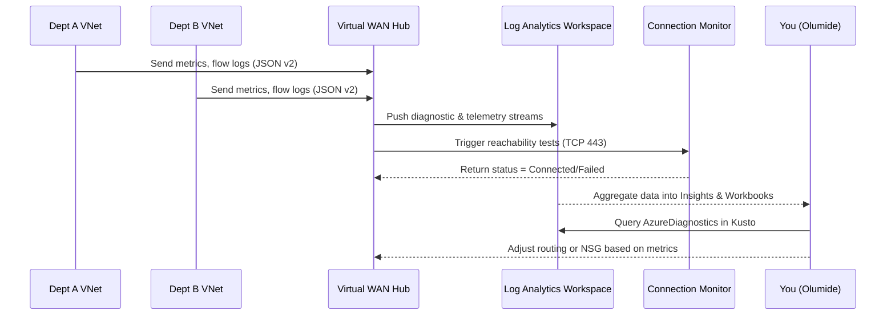

# 📊 Day 6 – Monitoring & Observability

In this module, you’ll enable visibility into your Virtual WAN environment — viewing health, logs, and connection analy>

---

## 🎯 Objectives

By the end of this lab you will:

1. Enable **vWAN Insights** to monitor hubs and connections
2. Configure **Network Watcher** and **Connection Monitor**
3. Enable **Flow Logs v2** on critical subnets
4. Visualize network flow data in **Azure Monitor Workbooks**

---

## 🧠 Concept Recap

| Component | Purpose |
|------------|----------|
| **vWAN Insights** | Native dashboard showing hub health, link throughput, latency, and branch status |
| **Flow Logs v2** | Captures traffic metadata at NSG/subnet level |
| **Connection Monitor** | Tests end-to-end reachability between resources |
| **Workbooks / Log Analytics** | Visual dashboards for trend visualization and troubleshooting |

---
🖼️ Diagram – Monitoring Flow

---

