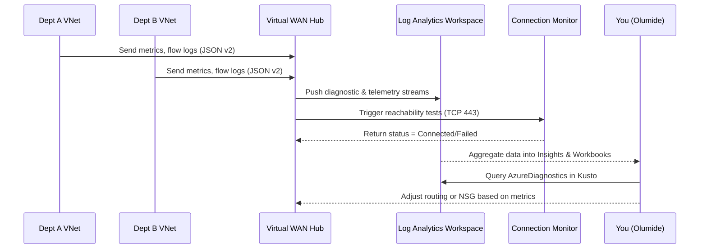

# 📊 Day 6 – Monitoring & Observability

In this module, you’ll enable visibility into your Virtual WAN environment — viewing health, logs, and connection analytics across all departments.

---

## 🎯 Objectives

By the end of this lab you will:

1. Enable **vWAN Insights** to monitor hubs and connections  
2. Configure **Network Watcher** and **Connection Monitor**  
3. Enable **Flow Logs v2** on critical subnets  
4. Visualize network flow data in **Azure Monitor Workbooks**

---

## 🧠 Concept Recap

| Component | Purpose |
|------------|----------|
| **vWAN Insights** | Native dashboard showing hub health, link throughput, latency, and branch status |
| **Flow Logs v2** | Captures traffic metadata at NSG/subnet level |
| **Connection Monitor** | Tests end-to-end reachability between resources |
| **Workbooks / Log Analytics** | Visual dashboards for trend visualization and troubleshooting |

---

## 🖼️ Diagram – Monitoring Flow



---

## 🧩 1️⃣ Enable vWAN Insights & Log Analytics Link

Create or reuse a Log Analytics workspace for metrics aggregation.

```bash
LA_NAME=${PREFIX}-${ENV}-logs
LOCATION=eastus

az monitor log-analytics workspace create \
  -g $RG -n $LA_NAME -l $LOCATION

# Link VWAN Hub telemetry to workspace
az network vwan update \
  -n ${PREFIX}-${ENV}-vwan \
  -g $RG \
  --enable-vwan-hub-logs true \
  --workspace "/subscriptions/$SUB_ID/resourcegroups/$RG/providers/microsoft.operationalinsights/workspaces/$LA_NAME"
Verify:

bash
Copy code
az monitor diagnostic-settings list \
  --resource "/subscriptions/$SUB_ID/resourceGroups/$RG/providers/Microsoft.Network/virtualHubs/$VHUB" -o table
🧩 2️⃣ Enable Flow Logs v2 on Dept VNets
Attach diagnostic settings at each subnet level.

bash
Copy code
for vnet in deptA-vnet deptB-vnet deptC-vnet; do
  az network watcher flow-log create \
    --location $LOCATION \
    --name ${vnet}-flowlog \
    --resource-group $RG \
    --nsg ${vnet}-nsg \
    --storage-account ${PREFIX}${ENV}flowstore \
    --enabled true \
    --format JSON \
    --version 2 \
    --log-analytics-workspace "/subscriptions/$SUB_ID/resourcegroups/$RG/providers/microsoft.operationalinsights/workspaces/$LA_NAME"
done
Verify Flow Logs:

bash
Copy code
az network watcher flow-log list --location $LOCATION -o table
🧩 3️⃣ Configure Connection Monitor
Use Connection Monitor v2 to validate inter-VNet and on-prem reachability.

bash
Copy code
az network watcher connection-monitor create \
  --name deptA-to-deptB \
  --resource-group $RG \
  --location $LOCATION \
  --endpoint-source deptA-vm \
  --endpoint-dest deptB-vm \
  --test-groups name=tcpTest,protocol=Tcp,port=443
Start monitoring:

bash
Copy code
az network watcher connection-monitor start \
  --name deptA-to-deptB -g $RG
Show recent results:

bash
Copy code
az network watcher connection-monitor query \
  --name deptA-to-deptB -g $RG --output table
🧩 4️⃣ Visualize Metrics in Workbooks
In the Azure Portal:

Navigate to Virtual WAN → Insights

Add tiles for VPN Gateway Throughput and Branch Status

Open Logs → NetworkMetrics
Sample query:

kusto
Copy code
AzureDiagnostics
| where Category == "FlowLog"
| summarize Count = count() by bin(TimeGenerated, 5m), Direction_s
| render timechart
Save as a custom workbook: vWAN Traffic Flow Overview

🧹 Cleanup (Optional)
To stop all diagnostics and minimize costs:

bash
Copy code
az network watcher flow-log delete --name deptA-vnet-flowlog --location $LOCATION -y
az monitor diagnostic-settings delete \
  --resource "/subscriptions/$SUB_ID/resourceGroups/$RG/providers/Microsoft.Network/virtualHubs/$VHUB" \
  --name vwan-insights -y

🧭 Summary
Action	Result
Enabled VWAN Insights	Hub metrics now visible in Monitor
Linked Log Analytics	All hub and NSG logs centralized
Flow Logs v2	Captured traffic per subnet
Connection Monitor	Active reachability tests between Depts

Next up: Day 7 – Data Security & Encryption 🔐
