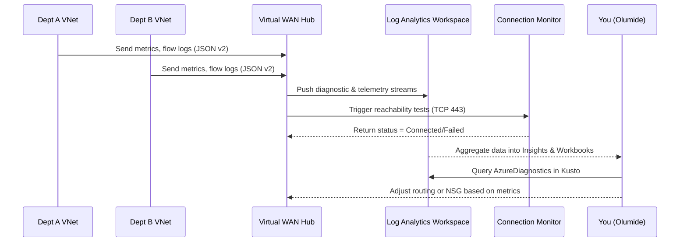
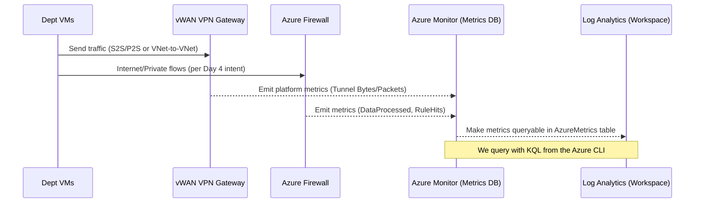

# 📊 Day 6 – Monitoring & Observability

In this module, you’ll enable visibility into your Virtual WAN environment — viewing health, logs, and connection analy>

---

## 🎯 Objectives

By the end of this lab you will:

1. Enable **vWAN Insights** to monitor hubs and connections
2. Configure **Network Watcher** and **Connection Monitor**
3. Enable **Flow Logs v2** on critical subnets
4. Visualize network flow data in **Azure Monitor Workbooks**

---

## 🧠 Concept Recap

| Component | Purpose |
|------------|----------|
| **vWAN Insights** | Native dashboard showing hub health, link throughput, latency, and branch status |
| **Flow Logs v2** | Captures traffic metadata at NSG/subnet level |
| **Connection Monitor** | Tests end-to-end reachability between resources |
| **Workbooks / Log Analytics** | Visual dashboards for trend visualization and troubleshooting |

---
## 🖼️ Diagram – Monitoring Flow

---

## 🧩 2️⃣ Enable Flow Logs v2 on Dept VNets

Attach diagnostic settings at each subnet level.

for vnet in deptA-vnet deptB-vnet deptC-vnet; do
  az network watcher flow-log create \
    --location $LOCATION \
    --name ${vnet}-flowlog \
    --resource-group $RG \
    --nsg ${vnet}-nsg \
    --storage-account ${PREFIX}${ENV}flowstore \
    --enabled true \
    --format JSON \
    --version 2 \
    --log-analytics-workspace "/subscriptions/$SUB_ID/resourcegroups/$RG/providers/microsoft.operationalinsights/workspaces/$LA_NAME"
done

Verify Flow Logs:

az network watcher flow-log list --location $LOCATION -o table

## 🧩 3️⃣ Configure Connection Monitor

Use Connection Monitor v2 to validate inter-VNet and on-prem reachability.

az network watcher connection-monitor create \
  --name deptA-to-deptB \
  --resource-group $RG \
  --location $LOCATION \
  --endpoint-source deptA-vm \
  --endpoint-dest deptB-vm \
  --test-groups name=tcpTest,protocol=Tcp,port=443

Start monitoring:

az network watcher connection-monitor start \
  --name deptA-to-deptB -g $RG

Show recent results:

az network watcher connection-monitor query \
  --name deptA-to-deptB -g $RG --output table

## 🧩 4️⃣ Visualize Metrics in Workbooks

In the Azure Portal:

Navigate to Virtual WAN → Insights

Add tiles for VPN Gateway Throughput and Branch Status

Open Logs → NetworkMetrics
Sample query:

AzureDiagnostics
| where Category == "FlowLog"
| summarize Count = count() by bin(TimeGenerated, 5m), Direction_s
| render timechart

Save as a custom workbook: vWAN Traffic Flow Overview

## 🧹 Cleanup (Optional)

To stop all diagnostics and minimize costs:

## 6.2 Metrics quickstart (AzureMetrics)

Why this matters (analogy): Think of AzureMetrics like a heart-rate monitor for each network device. Even if deep packet logs aren’t in yet, you can still see whether the “heart” (tunnels, firewall) is pumping and how hard.

## 📈 What we’ll validate

vWAN VPN Gateway tunnel activity (bytes/packets, drops).

Azure Firewall throughput and rule hits.

## 🧠 Diagram — “How metrics move”

---

## 🔎 Discover which resource IDs are in AzureMetrics

Shows the resources that have written metrics in last 24h
az monitor log-analytics query \
  --workspace "$LA_CUST" \
  --analytics-query "
AzureMetrics
| where TimeGenerated > ago(24h)
| summarize Rows=count() by ResourceId
| sort by Rows desc
| take 50" \
  -o table

Copy the full ResourceId for your VPN Gateway and Firewall from the output.
(Examples)

/subscriptions/56d9a9d0-65a3-4aea-9957-ff103f641f9c/resourceGroups/clab-dev-rg/providers/Microsoft.Network/vpnGateways/clab-dev-s2s-gw

/subscriptions/56d9a9d0-65a3-4aea-9957-ff103f641f9c/resourceGroups/clab-dev-rg/providers/Microsoft.Network/azureFirewalls/clab-dev-fw

## 🧪 VPN Gateway — tunnel throughput (bytes)

Metrics include TunnelIngressBytes and TunnelEgressBytes (per Microsoft docs). Use 5-minute bins to smooth spikes. 
Microsoft Learn
+1

GW_ID="/subscriptions/56d9a9d0-65a3-4aea-9957-ff103f641f9c/resourceGroups/clab-dev-rg/providers/Microsoft.Network/vpnGateways/clab-dev-s2s-gw"

az monitor log-analytics query \
  --workspace "$LA_CUST" \
  --analytics-query "
let gw = '$GW_ID';
AzureMetrics
| where TimeGenerated > ago(2h)
| where ResourceId == gw
| where MetricName in ('TunnelIngressBytes','TunnelEgressBytes')
| summarize TotalBytes=sum(Total) by MetricName, bin(TimeGenerated, 5m)
| sort by TimeGenerated asc" \
  -o table

## 🧪 VPN Gateway — packet drops (health signal)

Drop metrics: TunnelIngressPacketDropCount and TunnelEgressPacketDropCount. Any > 0 deserves attention. 
Microsoft Learn
+1

az monitor log-analytics query \
  --workspace "$LA_CUST" \
  --analytics-query "
let gw = '$GW_ID';
AzureMetrics
| where TimeGenerated > ago(2h)
| where ResourceId == gw
| where MetricName in ('TunnelIngressPacketDropCount','TunnelEgressPacketDropCount')
| summarize Drops=sum(Total) by MetricName, bin(TimeGenerated, 5m)
| sort by TimeGenerated asc" \
  -o table

## 🔥 Azure Firewall — data processed & rule hits

Useful metrics: DataProcessed, ApplicationRuleHit, NetworkRuleHit, FirewallHealth. 
Microsoft Learn
+1

FW_ID="/subscriptions/56d9a9d0-65a3-4aea-9957-ff103f641f9c/resourceGroups/clab-dev-rg/providers/Microsoft.Network/azureFirewalls/clab-dev-fw"

## Throughput over time
az monitor log-analytics query \
  --workspace "$LA_CUST" \
  --analytics-query "
let fw = '$FW_ID';
AzureMetrics
| where TimeGenerated > ago(2h)
| where ResourceId == fw
| where MetricName == 'DataProcessed'
| summarize Bytes=sum(Total) by bin(TimeGenerated, 5m)
| sort by TimeGenerated asc" \
  -o table

## Rule hits summary
az monitor log-analytics query \
  --workspace "$LA_CUST" \
  --analytics-query "
let fw = '$FW_ID';
AzureMetrics
| where TimeGenerated > ago(2h)
| where ResourceId == fw
| where MetricName in ('ApplicationRuleHit','NetworkRuleHit')
| summarize Hits=sum(Total) by MetricName, bin(TimeGenerated, 5m)
| sort by TimeGenerated asc" \
  -o table

## Health signal (0–100%)
az monitor log-analytics query \
  --workspace "$LA_CUST" \
  --analytics-query "
let fw = '$FW_ID';
AzureMetrics
| where TimeGenerated > ago(2h)
| where ResourceId == fw
| where MetricName == 'FirewallHealth'
| summarize HealthPct=avg(Average) by bin(TimeGenerated, 5m)
| sort by TimeGenerated asc" \
  -o table

## 🧭 Interpretation cheatsheet

TunnelIngress/EgressBytes rising during test traffic = tunnels are alive.

PacketDropCount > 0 = mismatches or instability — check IPsec, selectors, routes. 
Microsoft Learn

Firewall DataProcessed > 0 during web egress = Internet traffic is correctly hair-pinned through the hub. 
Microsoft Learn

RuleHit spikes = your policy is actively filtering (expected with Day 3/4 rules). 
Microsoft Learn

## 🧩 If you don’t see rows yet

Re-run the ResourceId inventory query above to confirm the IDs.

Generate cross-dept traffic (A↔B, A↔Internet) — metrics typically appear quickly.

Flow-logs to Log Analytics may arrive slower; they’re separate from AzureMetrics. For virtual network flow logs, follow Microsoft’s current guidance. 
Microsoft Learn
+1

References

Monitoring data reference for Azure vWAN & VPN Gateway (metric names). 
Microsoft Learn
+1

Azure Firewall metrics and log categories. 
Microsoft Learn
+1

Azure Monitor Metrics & AzureMetrics table behavior. 
Microsoft Learn
+1
