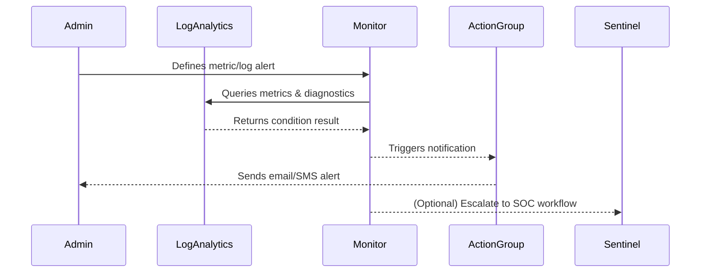
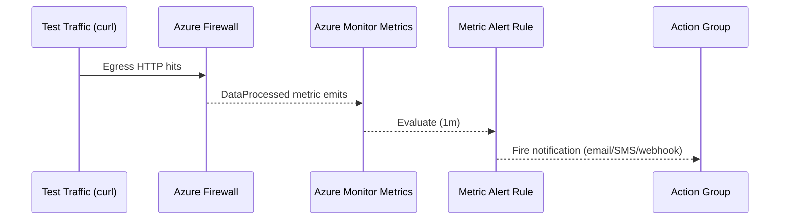

# 🧭 Day 7 – Alerting & Incident Response (Azure Monitor | Sentinel | Email/SMS Hooks)

## 7.1 Objective

Set up alert rules, action groups, and automated responses for Virtual WAN, Firewall, and Log Analytics insights.  
You will validate that critical network or security events trigger notifications to your team.

---

## 7.2 Lab Steps

**Step 1 — Define environment variables**

RG=clab-dev-rg
LA_NAME=clab-dev-logs
PREFIX=clab
ENV=dev
LOCATION=eastus
SUB_ID=$(az account show --query id -o tsv)

**Step 2 — Create an Action Group**

This action group will notify your email or SMS when alerts trigger.

az monitor action-group create \
  -g $RG \
  -n ${PREFIX}-${ENV}-alerts \
  --action email AdminAlerts you@example.com \
  --short-name AGAlerts

**Step 3 — Create example metric alert (Firewall metrics)**

az monitor metrics alert create \
  -n ${PREFIX}-${ENV}-fw-cpu-alert \
  -g $RG \
  --scopes "/subscriptions/$SUB_ID/resourceGroups/$RG/providers/Microsoft.Network/azureFirewalls/${PREFIX}-${ENV}-firewall" \
  --condition "avg CpuUtilization > 75" \
  --description "High Azure Firewall CPU utilization" \
  --action-group ${PREFIX}-${ENV}-alerts

**Step 4 — Create example log alert (from Log Analytics workspace)**

az monitor scheduled-query create \
  -n ${PREFIX}-${ENV}-vwan-conn-failure \
  -g $RG \
  --scopes "/subscriptions/$SUB_ID/resourcegroups/$RG/providers/microsoft.operationalinsights/workspaces/$LA_NAME" \
  --description "Virtual WAN connection failure events" \
  --action-group ${PREFIX}-${ENV}-alerts \
  --condition "count > 0" \
  --query "
AzureDiagnostics
| where Category contains 'VpnGatewayDiagnosticLog'
| where properties_s contains 'ConnectionFailed'
" \
  --window-size 5m --evaluation-frequency 5m

**Step 5 — (Optional) Integrate with Microsoft Sentinel**

If your environment uses Sentinel, link your workspace and create an analytic rule template.

az sentinel alert-rule create \
  --resource-group $RG \
  --workspace-name $LA_NAME \
  --rule-template-id "a6b3e79d-6e2a-4b10-9b2c-6d8b93b715f2" \
  --enabled true

## 7.3 Validation

**List all alert rules**

az monitor metrics alert list -g $RG -o table
az monitor scheduled-query list -g $RG -o table

**Simulate a trigger (optional)**

az monitor metrics alert test -n ${PREFIX}-${ENV}-fw-cpu-alert -g $RG

## 7.4 Cleanup

az monitor metrics alert delete -n ${PREFIX}-${ENV}-fw-cpu-alert -g $RG -y
az monitor scheduled-query delete -n ${PREFIX}-${ENV}-vwan-conn-failure -g $RG -y
az monitor action-group delete -n ${PREFIX}-${ENV}-alerts -g $RG -y

## 7.5 Diagram

---

## ✅ Deliverables

Alert rules active in Azure Monitor

Action group notifications verified

Log alert linked to Virtual WAN or Firewall diagnostics

Optional Sentinel rule created

## 7.6 Validation – live alerts

**Verify the alerts exist**

az monitor metrics alert list -g "$RG" -o table
Force a quick trigger (DataProcessed)
We’ll create a temporary low-threshold alert that fires as soon as any traffic passes the firewall, then remove it after verification.

## IDs
SUB_ID=$(az account show --query id -o tsv)
FW_ID=$(az network firewall show -g "$RG" -n "clab-dev-fw" --query id -o tsv)
AG_ID=$(az monitor action-group show -g "$RG" -n "clab-dev-alerts" --query id -o tsv)

## Temp alert: fires if any bytes are processed in 5 minutes
az monitor metrics alert create \
  -n ${PREFIX}-${ENV}-fw-throughput-test \
  -g "$RG" \
  --scopes "$FW_ID" \
  --condition "total DataProcessed > 1" \
  --window-size 5m \
  --evaluation-frequency 1m \
  --description "TEMP: DataProcessed > 1 byte in 5m" \
  --action "$AG_ID"

## Generate traffic (from a VM behind the firewall)
## e.g., curl some sites a few times
##   curl -I https://www.microsoft.com
##   curl -I https://example.com

## See alert objects
az monitor metrics alert list -g "$RG" -o table
Notifications should go to the clab-dev-alerts action group targets you set earlier.

Inspect recent alert activity (Activity Log)

## Show recent Administrative events related to alerts in the RG
az monitor activity-log list \
  --resource-group "$RG" \
  --status Succeeded \
  --max-events 20 -o table
Cleanup (remove the temporary test alert)
az monitor metrics alert delete -g "$RG" -n ${PREFIX}-${ENV}-fw-throughput-test -y

Diagram – alert signal path

---

