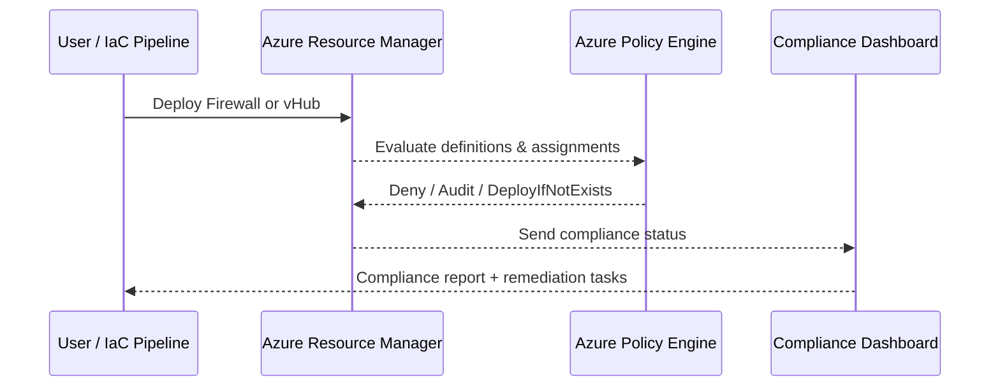

# 🧭 Day 8 – Policy & Governance

> **Objective:**  
> Establish consistent compliance and guardrails across all vWAN components — Virtual Hubs, Firewalls, VNets, Route Tables — using **Azure Policy**, **Initiatives**, and **Remediation Tasks**.

---

## 8.1 Concept Overview

Azure Policy provides governance as code.  
It continuously evaluates resource configurations against defined standards and can:

- **Audit** existing non-compliant resources  
- **Deny** non-compliant changes in real time  
- **DeployIfNotExists** to automatically enforce settings  

### 🎯 Governance goals for this lab

| Domain | Example Policy |
|:--|:--|
| Networking | Enforce private DNS zones for VNets |
| Security | Require threat intelligence on Azure Firewall |
| Logging | Require diagnostics to Log Analytics |
| Compliance | Only allow specific regions (e.g. East US) |

---

## 8.2 Pre-requisites

RG=clab-dev-rg
PREFIX=clab
ENV=dev
LOCATION=eastus
Make sure the following exist:

Virtual WAN hub

Log Analytics workspace

Azure Firewall

Diagnostics (from Day 6)

Alerts (from Day 7)

## 8.3 Create a Policy Definition

Example 1 – Enforce Firewall Threat Intel
az policy definition create \
  -n ${PREFIX}-${ENV}-require-fw-threatintel \
  --display-name "Require Threat Intelligence Mode on Azure Firewalls" \
  --description "Audits and optionally enforces that Azure Firewalls enable Threat Intel Mode." \
  --mode All \
  --rules ./policy/fw-threatintel.json
fw-threatintel.json

{
  "if": {
    "allOf": [
      { "field": "type", "equals": "Microsoft.Network/azureFirewalls" },
      { "not": { "field": "Microsoft.Network/azureFirewalls/threatIntelMode", "equals": "Alert" } }
    ]
  },
  "then": {
    "effect": "audit"
  }
}

## 8.4 Assign the Policy

az policy assignment create \
  -n ${PREFIX}-${ENV}-fw-threatintel-assign \
  --display-name "Audit Firewall Threat Intel" \
  --policy "${PREFIX}-${ENV}-require-fw-threatintel" \
  --scope "/subscriptions/$SUB_ID/resourceGroups/$RG"

## 8.5 Evaluate and Remediate

# Trigger compliance scan
az policy state trigger-scan --resource-group "$RG"

# Show non-compliant resources
az policy state list --resource-group "$RG" \
  --query "[].{Resource:id, Compliance:complianceState}" -o table
If effect = audit, you’ll see “NonCompliant” until manual or automatic remediation.

## 8.6 Initiatives & Built-in Policies
You can combine multiple definitions into one initiative (a “policy set”).
Example:

az policy set-definition create \
  -n ${PREFIX}-${ENV}-vwan-governance \
  --display-name "vWAN Governance Baseline" \
  --definitions "[{'policyDefinitionId':'/providers/Microsoft.Authorization/policyDefinitions/0a15ec92-47a9-4fb4-9b5c-0ef7f0e75c7a'}]"
To assign:

az policy assignment create \
  -n ${PREFIX}-${ENV}-vwan-governance-assign \
  --display-name "vWAN Governance Baseline Assignment" \
  --scope "/subscriptions/$SUB_ID/resourceGroups/$RG" \
  --policy-set-definition ${PREFIX}-${ENV}-vwan-governance

## 8.7 Diagram – Governance Flow

---

## 8.8 Cleanup (optional)

az policy assignment delete -n ${PREFIX}-${ENV}-fw-threatintel-assign -y
az policy definition delete -n ${PREFIX}-${ENV}-require-fw-threatintel -y

✅ End of Day 8
You now have a living governance baseline ready for continuous compliance scans.
